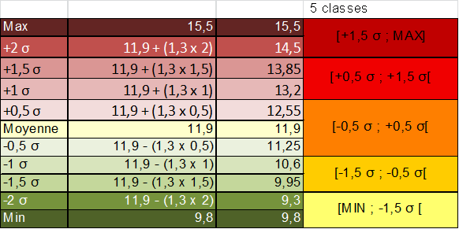

```{r setup, global_options,include=FALSE}
knitr::opts_chunk$set(
  dpi = 200,
  #fig.width = 7,
  #fig.height = 4,
  strip.white = T,
  #dev = "png",
  #dev.args = list(png = list(bg = "transparent")),
  message=FALSE,
  comment=NA,
  echo=FALSE,
  warning=FALSE,
  eval=TRUE
  
)
```

```{r include=FALSE}
source('./assets/functions.R')

requiredPackages = c('knitr','ggplot2','RColorBrewer','kableExtra',
                     'rgdal','classInt','tmap','spdplyr','dplyr','dotenv')

PackageFacile(requiredPackages)

load_dot_env(".env")
annee=Sys.getenv("annee")


```


class: center, middle, inverse, title-slide, animated, fadeIn
# ENSG : statistiques appliquées en cartographie `r annee`
# Cours n°3- La discrétisation en cartographie<br /> <br />
### Florian Bayer


<div class="my-footer"><span>ENSG - L1 `r annee` : Statistiques appliquées en cartographie- Florian Bayer</span></div> 

---
class: animated, fadeIn
## Objectifs du cours
<div class="my-footer"><span>ENSG - L1 `r annee` : Statistiques appliquées en cartographie- Florian Bayer</span></div> 

En cartographie et en statistique, il est parfois nécessaire de **simplifier** l'information à transmettre. 

Notamment lorsque la quantité d'information à représenter est très importante. 

La **réduction** de l'information au sein de **classes** est appelée la **discrétisation**.

On passe ainsi de données continues (ou discrètes mais très nombreuses) à quelques classes, qui regroupent en leur sein les données initiales

.center-img[
```{r echo=FALSE, out.width="90%"}
knitr::include_graphics("https://i.imgur.com/tR8IkiK.png")
```
] 

La prise en compte du message cartographique (objectif, public, format, support) ainsi que la description de la série de données à l'aide de l'analyse univariée permettent de **choisir** et de **justifier** la ou les méthodes de discrétisation les plus adaptées.

---
class: animated, fadeIn
## Schéma de production
<div class="my-footer"><span>ENSG - L1 `r annee` : Statistiques appliquées en cartographie- Florian Bayer</span></div> 

.zoom[ .center-img[
```{r echo=FALSE, out.width="100%"}
knitr::include_graphics("https://i.imgur.com/a1cdFjb.png")
```
] ]


---
class: inverse, center, middle, animated, fadeIn  
# 1- Les principes de la discrétisation


<div class="my-footer-title "></div> 

---
class: animated, fadeIn
## Principe
<div class="my-footer"><span>ENSG - L1 `r annee` : Statistiques appliquées en cartographie- Florian Bayer</span></div> 
Lorsque l'on résume l'information par la discrétisation, on cherche à :
- **regrouper** les entités qui se **ressemblent** le plus entre elles : l’intérieur des classes est **homogène**.
- **séparer** les entités les plus **différentes** : les classes sont **hétérogènes** les unes par rapport aux autres.


---
class: animated, fadeIn
## Avec des données qualitatives
<div class="my-footer"><span>ENSG - L1 `r annee` : Statistiques appliquées en cartographie- Florian Bayer</span></div> 
On groupe les éléments semblables dans une même classe (homogènéité) et on fait en sorte que les classes soient très différentes les unes des autres (hétérogénéité)    


.center-img[
```{r echo=FALSE, out.width="75%"}
knitr::include_graphics("https://i.imgur.com/If1pYWs.png")
```
]

--

.center-img[
```{r echo=FALSE, out.width="75%"}
knitr::include_graphics("https://i.imgur.com/WYpc2tV.png")
```
] 

---
class: animated, fadeIn
## Avec des données quantitatives...
<div class="my-footer"><span>ENSG - L1 `r annee` : Statistiques appliquées en cartographie- Florian Bayer</span></div> 
.center-img[
```{r echo=FALSE, out.width="75%"}
knitr::include_graphics("https://i.imgur.com/2r6ajkG.png")
```
] 

--

.center-img[
```{r echo=FALSE, out.width="75%"}
knitr::include_graphics("https://i.imgur.com/W4ZrEvp.png")
```
] 

--

.center-img[
```{r echo=FALSE, out.width="75%"}
knitr::include_graphics("https://i.imgur.com/zqXpowl.png")
```
] 

L'analyse univariée est permet alors de visualiser les **spécificités** de la série (mode, symétrie, valeurs extrêmes...) ainsi que le **résumé** et la **dispersion** des données.


---
class: animated, fadeIn
## Quantitatif de taux et discrétisation
<div class="my-footer"><span>ENSG - L1 `r annee` : Statistiques appliquées en cartographie- Florian Bayer</span></div> 
.center-img[
```{r echo=FALSE, out.width="100%"}
knitr::include_graphics("https://i.imgur.com/IkQQ5dF.png")
```
] 

---
class: animated, fadeIn
## Impact sur le message cartographique
<div class="my-footer"><span>ENSG - L1 `r annee` : Statistiques appliquées en cartographie- Florian Bayer</span></div> 


.center-img[
Mêmes données, différents messages liés à la discrétisation

```{r echo=FALSE, out.width="100%"}
knitr::include_graphics("https://i.imgur.com/RJWBDNO.png")
```
] 


---
class: animated, fadeIn
## Données qualitatives
<div class="my-footer"><span>ENSG - L1 `r annee` : Statistiques appliquées en cartographie- Florian Bayer</span></div> 

.center-img[
Discrétisation non obligatoire, tout dépend de l'objectif de la carte

```{r echo=FALSE, out.width="100%"}
knitr::include_graphics("https://i.imgur.com/PgORjIt.png")
```
]

---
class: animated, fadeIn
## Données quantitatives de stock
<div class="my-footer"><span>ENSG - L1 `r annee` : Statistiques appliquées en cartographie- Florian Bayer</span></div> 
.pull-left3[.center-img[
```{r echo=FALSE, out.width="100%"}
knitr::include_graphics("https://i.imgur.com/4mxffkP.png")
```
]]

.pull-right1[
Avantage de la variable visuelle forme pour les données quantitatives de stock : proportionnalité.

- Une valeur représentée = une surface de cercle. Les surfaces sont proportionnelles entre elles.
- L’œil perçoit facilement si un cercle est deux fois plus gros qu’un autre : pas besoin de discrétiser, pas de perte d’information statistique.
]

---
class: animated, fadeIn
## Données quantitatives de taux
<div class="my-footer"><span>ENSG - L1 `r annee` : Statistiques appliquées en cartographie- Florian Bayer</span></div> 
La longueur de la variable visuelle valeur ne permet pas à l'oeil d'associer un niveau de gris à une seule valeur. Seule la notion d'ordre est transmise. Il est nécessaire de réduire le nombre de niveau de gris pour y associer une plage de valeur (de 0 à 7, puis de 7 à 15 par exemple).

.center-img[
```{r echo=FALSE, out.width="100%"}
knitr::include_graphics("https://i.imgur.com/u9mwHcH.png")
```
]


---
class: animated, fadeIn
## En amont de la discrétisation
<div class="my-footer"><span>ENSG - L1 `r annee` : Statistiques appliquées en cartographie- Florian Bayer</span></div> 
Le rôle du cartographe est de déterminer en amont de la production cartographique **la meilleur discrétisation**. Pour cela, il faut :
- Se poser les questions : est ce qu'il faut mettre en avant la répartition spatiale la plus **conforme** à la répartition statistique ? Est-ce que ma carte sera **comparée** à une autre ? Dans le temps ? Avec des données de même nature ?
- Se poser la question : est-ce que mon **public** à besoin d'une discrétisation ''simple'', quitte à perdre une partie de l'information statistique.
- Analyser la distribution statistique : en la résumant par les **valeurs centrales**, puis par les **paramètres de dispersion**.
En fonction de ces points, la méthode de discrétisation peut-être **choisie** et **justifiée.**

---
class: animated, fadeIn
## S'appuyer sur l'analyse univariée de la série
<div class="my-footer"><span>ENSG - L1 `r annee` : Statistiques appliquées en cartographie- Florian Bayer</span></div> 
Il est essentiel de comprendre **la forme de la distribution** de la ou des séries de données avec les outils de l’analyse univariée : 
- Elle permet de faire un **compromis** entre information statistique, information géographique et la bonne transmission du message.
- Elle permet **résumer** l’information en conservant la forme de la distribution
- Elle permet si besoin de mettre en évidence les valeurs **remarquables** et de les faire **apparaître** sur la **carte** ou le diagramme. 
- Elle évite de créer des classes vides
- Elle donne les **éléments scientifiques** pour justifier et reproduire ses choix
Dans le cas contraire, vous risquez d’avoir une carte n’apportant que très peu d’information, car la discrétisation sera mal adaptée au message cartographique.

---
class: animated, fadeIn
## Suivre la forme de la distribution
<div class="my-footer"><span>ENSG - L1 `r annee` : Statistiques appliquées en cartographie- Florian Bayer</span></div> 
.center-img[
```{r echo=FALSE, out.width="100%"}
knitr::include_graphics("https://i.imgur.com/yvaqLfY.png")
```
]

---
class: animated, fadeIn
## Suivre la forme de la distribution : exemple
<div class="my-footer"><span>ENSG - L1 `r annee` : Statistiques appliquées en cartographie- Florian Bayer</span></div> 

.pull-left[Les classes ne  suivent pas la forme de la distribution. 

L'histogramme montre bien que la première classe contient des données très hétérogènes, ce qui se traduit par une transmission faussée de l'information sur la carte. 

Des régions **très** **différentes** sur la carte se retrouvent donc **regroupées.**]

.pull-right[.center-img[
```{r echo=FALSE, out.width="100%"}


dsn = "./data/L93_region.geojson"
spdf.ICF <- readOGR(dsn=dsn,layer="L93_REGION",verbose = F)

df.icf <- data.frame("Code" = c('74','94','83','54','26','72','73','41','25','91',
                                '53','24','93','21','42','43','52','23','22','82','31','11'),
                      "TxNat09" = c(9.8,9.8,10.3,10.6,10.8,10.8,11.1,11.4,11.4,11.6,11.7,11.9,12,12,12,12.3,12.9,12.9,13,13.1,13.9,15.5))

spdf.ICF <- dplyr::left_join(spdf.ICF,df.icf,by = c("INSEE_REG" = "Code")) %>%
  arrange(TxNat09)

tm_shape(spdf.ICF) +
  tm_fill(col = "TxNat09",  palette = 'YlOrRd',
  breaks = c(9.8, 12.5, 13, 14, 15.5),
  title = 'Taux de natalité en 2009',
  legend.is.portrait = T, legend.reverse = FALSE,
  legend.hist = T,
  legend.format = list(text.separator = "à")) + 
  tm_borders(col = NA, lwd = 1, lty = "solid", alpha = NA,
  group = NA)+
  tm_legend(legend.outside.position = "bottom", legend.outside= T,
	hist.width= 15,hist.height= 8, frame = F,bg.color = "grey85")+
  tm_layout(outer.margins=c(0,0,0,0),bg.color = "grey85")

```
]]

---
class: animated, fadeIn
## Suivre la forme de la distribution
<div class="my-footer"><span>ENSG - L1 `r annee` : Statistiques appliquées en cartographie- Florian Bayer</span></div> 

.pull-left[
En suivant la forme de la distribution, on voit bien l'information statistique est mieux transmise que dans l'exemple précédent.

Les régions avec des valeurs proches sont **regroupées** dans les **mêmes classes**.]
.pull-right[.center-img[
```{r echo=FALSE, out.width="100%"}
tm_shape(spdf.ICF) +
  tm_fill(col = "TxNat09",  palette = 'YlOrRd',
  style = 'jenks',
  title = 'Taux de natalité en 2009',
  legend.is.portrait = T, legend.reverse = FALSE,
  legend.hist = T,
  legend.format = list(text.separator = "à")) + 
  tm_borders(col = NA, lwd = 1, lty = "solid", alpha = NA,
  group = NA)+
  tm_legend(legend.outside.position = "bottom", legend.outside= T,
	hist.width= 15,hist.height= 8, frame = F,bg.color = "grey85")+
  tm_layout(outer.margins=c(0,0,0,0),bg.color = "grey85")

```
]]

---
class: animated, fadeIn
## Règles
<div class="my-footer"><span>ENSG - L1 `r annee` : Statistiques appliquées en cartographie- Florian Bayer</span></div> 
En cartographie, le découpage en classes d’une série de données suit les mêmes règles qu’en statistique :
- Les classes couvrent l’ensemble de la série statistique
- Elles sont contiguës (il n’y a pas de zone « vide » )
- Une valeur ne peut appartenir qu’à une seule classe
- Aucune classe ne doit être vide

---
class: animated, fadeIn
## Règles
<div class="my-footer"><span>ENSG - L1 `r annee` : Statistiques appliquées en cartographie- Florian Bayer</span></div> 
.center-img[
```{r echo=FALSE, out.width="100%"}
knitr::include_graphics("https://i.imgur.com/h38bwNW.png")
```
]

---
class: animated, fadeIn
## Simple dans la pratique, mais...
<div class="my-footer"><span>ENSG - L1 `r annee` : Statistiques appliquées en cartographie- Florian Bayer</span></div> 
.pull-left[.center-img[
```{r echo=FALSE, out.width="100%"}
knitr::include_graphics("https://i.imgur.com/JPD2S3x.jpg")
```
]]

.pull-right[
Attention, certaines contraintes peuvent s’ajouter et complexifier la discrétisation :
- besoin de visualiser à un instant t un phénomène (le plus simple).
- Besoin de comparer des données identiques à deux dates.
- Besoin de comparer des données différentes.
]


---
class: inverse, center, middle, animated, fadeIn  
# 2- Les méthodes de discrétisation


<div class="my-footer-title "></div> 

---
class: animated, fadeIn
## Les principales méthodes 
<div class="my-footer"><span>ENSG - L1 `r annee` : Statistiques appliquées en cartographie- Florian Bayer</span></div> 
Il existe plusieurs méthodes de discrétisation utilisées en cartographie :
- La méthode des quantiles (effectifs égaux).
- Les amplitudes égales.
- Moyenne et écart type.
- Les seuils naturels.
- Les intervalles géométriques.
- etc.

Toutes ont leur avantages et inconvénients et sont donc à choisir en fonction des besoins et de la forme de la série statistique

---
class: animated, fadeIn
## Les quantiles (effectifs égaux)

- **Concept** : même nombre d’individus dans chaque classe    
- **Construction** : nombre total d'individus (les départements) / nombre de classes souhaités
___

.font90[
.pull-left[
**Avantages : **
- Très facile à réaliser.
- Facilement compréhensible par le lecteur.
- Permet de comparer la position des individus géographiques dans différentes distributions (ordre de grandeur). Les bornes de classes ne seront pas les mêmes.
- Applicable à toutes les formes de distributions.
]

.pull-right[
**Inconvénients :**
- Risque de perte d’information sur la forme de la distribution.
- Ne met pas forcément en évidence les valeurs extrêmes (max, min).
]]

<div class="my-footer"><span>ENSG - L1 `r annee` : Statistiques appliquées en cartographie- Florian Bayer</span></div> 

---
class: animated, fadeIn
## Les quantiles : variante Q6

 
- **Concept** : Pour contourner le problème des valeurs extrêmes non mises en évidence avec les quantiles, Philcarto propose une méthode dite Q6. Ce sont des quartiles, mais la première classe contient les cinq pourcents valeurs les plus petites et non 25%, la dernière classe les cinq pourcents valeurs les plus fortes.    
- **Construction** : **[Min : 5% [** U [5% ; 25%[ U [25% ; 50%[ U [50% ; 75 %[ U [75% ; 95 %[ U **[95% : max]**

___

.font90[
.pull-left[
**Avantages :**
- Facile à réaliser (on fait des quartiles et on ajuste).
- Mise en évidence des valeurs extrêmes.
- Permet de comparer la position des individus géographiques dans différentes distributions (ordre de grandeur). Les bornes de classes ne seront pas les mêmes.
- Applicable à toutes les formes de distributions.
]

.pull-right[
**Inconvénients :**
- Risque de perte d’information sur la forme de la distribution (mais moins que pour des quantiles).
- Moins compréhensible par le lecteur que les quantiles (peu utilisée).
]]

<div class="my-footer"><span>ENSG - L1 `r annee` : Statistiques appliquées en cartographie- Florian Bayer</span></div> 

---
class: animated, fadeIn
## Les amplitudes égales

- **Concept** : Les classes ont la même étendue (de 10 en 10, de 5 en 5 etc.)	    
- **Construction** : (max – min) / nombre de classes souhaités
___

.font90[
.pull-left[
**Avantages : **
- Très facile à réaliser.
- Facilement compréhensible par le lecteur.
- Permet la comparaison dans le temps d’un même phénomène (il faut discrétiser sur une même série comprenant toutes les dates). Les bornes de classes seront les mêmes entre les deux dates.
- Efficace sur les distributions uniformes.
]

.pull-right[
**Inconvénients :**
- Très mal adaptée à une distribution non uniforme.
- Succeptible de créer des classes vides.
]]

<div class="my-footer"><span>ENSG - L1 `r annee` : Statistiques appliquées en cartographie- Florian Bayer</span></div> 

---
class: animated, fadeIn
## La moyenne et l’écart-type


- **Concept** : Les classes se basent sur les propriétés de la loi normale    
- **Remarque** : La moyenne est de préférence au centre d’une classe. L’amplitude de la classe correspond à l’écart type (0,5 σ,  1 σ, 1,5 σ)    
**Construction** :  [Min ; -1,5 σ[ U [-1,5 ; -0,5 σ[ U [-0,5 σ; +0,5 σ[ U [+0,5 σ; +1,5 σ[ U [+1,5, σ; Max]    

___

.font90[
.pull-left[
**Avantages :**
- A un sens sur les distribution gaussienne et permet dans ce cas un bon compromis géographique/statistique. Les classes extrèmes montrent les valeurs anormales, les classes centrales les valeurs proches de la normale.
- Facilement compréhensible par le lecteur.
- Permet la comparaison, si chaque série est gaussienne et si vous utilisez la même méthode de construction. 
]


.pull-right[
**Inconvénients :**
- Difficile à comprendre pour le lecteur non initié (propriétés de la loi normale).
- Uniquement pour les distributions normales.
]

Il est possible de transformer une série dissymétrique à gauche en série normale en transformant les données en logarithme.
]

<div class="my-footer"><span>ENSG - L1 `r annee` : Statistiques appliquées en cartographie- Florian Bayer</span></div> 

---
class: animated, fadeIn
## Seuils naturels

**Concept** : les classes suivent au mieux la forme de la distribution, en regroupant les valeurs semblables et en isolant les valeurs extrêmes.    
**Construction** : le cartographe défini à la main les bornes de classes en fonction de la répartition des valeurs sur le diagramme de distribution     

___

.font90[
.pull-left[
**Avantage :**
- Permet un excellent compromis entre la transmission de l’information et la conservation des caractéristiques de la distribution statistiques
]

.pull-right[
**Inconvénients :**
- Subjectif. Deux personnes travaillant sur la même série de données n'auront pas forcément les mêmes résultats.
- Ne permet pas la comparaison de cartes si les bornes ne sont pas identiques.
]

Il existe un algorithme permettant le calcul optimal des bornes de classes : **Jenks.** 
- Les classes regroupent en leur sein les valeurs les plus semblables (minimise la variance intra-classe)
- et elles sont le plus différentes possibles les unes par rapport aux autres (maximise la variance inter-classe) 
]

<div class="my-footer"><span>ENSG - L1 `r annee` : Statistiques appliquées en cartographie- Florian Bayer</span></div> 

---
class: inverse, center, middle, animated, fadeIn  
# 3- Questions fréquentes


<div class="my-footer-title "></div> 

---
class: animated, fadeIn
## Combien de classes ?

Pour les données de taux, la transmission du message est en grande partie liée à la discrétisation. En cartographie, discrétiser une série statistique suppose donc un **compromis** entre :
- La représentation et la transmission du message cartographique.
- Garder les informations de la distribution statistiques.

En règle générale, le nombre de classes va de **4 à 7**
- En dessous, l’information spatiale sera trop faible.
- Au delà, la carte sera trop complexe à comprendre : trop d’informations visuelles, la longueur de la variable visuelle valeur ne permet pas à votre oeil d'associer les différents niveaux de gris de la carte avec ceux de la légende.

Vous prendrez un minimum de risques avec une discrétisation en **5 classes.**
<div class="my-footer"><span>ENSG - L1 `r annee` : Statistiques appliquées en cartographie- Florian Bayer</span></div> 

---
class: animated, fadeIn
## Faut-il arrondir les valeurs des classes ?
<div class="my-footer"><span>ENSG - L1 `r annee` : Statistiques appliquées en cartographie- Florian Bayer</span></div> 
.pull-left[.center-img[
```{r echo=FALSE, out.width="60%"}
knitr::include_graphics("https://i.imgur.com/NiIBy9c.gif")
knitr::include_graphics("https://i.imgur.com/lMLLIOt.gif")
knitr::include_graphics("https://i.imgur.com/8ISU7C5.gif")
```
]]

.pull-right[
**Oui :**
- A part en science physique, garder 10 chiffres après la virgule n'a pas trop d'intérêt .
- Dans la plupart des cas, arrondissez à un chiffre après la virgule, deux au maximum.
- Mais il faut arrondir en **amont** de la mise en page, c'est à dire sur Excel ou dans Philcarto. Cela évitera qu'un individu se retrouve dans la mauvaise classe (dans un logiciel de cartographie, changer bornes de classes met à jour automatiquement le rendu. Ce n'est pas le cas d'un logiciel de dessin assisté par ordinateur)
]

<div class="my-footer"><span>ENSG - L1 `r annee` : Statistiques appliquées en cartographie- Florian Bayer</span></div> 

---
class: animated, fadeIn
## Comment comparer des séries ?

Dans certains cas, il est nécessaire de réaliser des cartes dans un objectif de comparaison :
- Comment a évolué un même phénomène dans le temps et l’espace ?
- Est-ce que la répartition d’un phénomène A possède la même répartition qu’un phénomène B ?

Deux possibilités s’offrent au cartographe, en fonction du contexte :
- Soit comparer des donnés de même natures. On privilégiera la comparaison **absolue.** : on compare les unités de mesure. Les bornes de classes doivent donc être identiques.
- Ou comparer des données de natures différentes. On devra alors comparer les séries de manière **relative** : on compare les n% individus de chaque classe. On fait donc en sorte que les effectifs de classes des différentes séries soient identiques.
<div class="my-footer"><span>ENSG - L1 `r annee` : Statistiques appliquées en cartographie- Florian Bayer</span></div> 

---
class: animated, fadeIn
## Comparaison absolue

Si on souhaite comparer des données identiques, il faut que les bornes de classes des cartes soient les mêmes : comparaison absolue. 
- Amplitude égale.
- Seuil naturel (Jenks) sur une des cartes et application des mêmes bornes de classes à la seconde carte.
- Tout autre méthode du moment que les bornes de classes soient identiques.

<div class="my-footer"><span>ENSG - L1 `r annee` : Statistiques appliquées en cartographie- Florian Bayer</span></div> 

---
class: animated, fadeIn
## Comparaison absolue : exemple

.center-img[
```{r echo=FALSE, out.width="80%"}
knitr::include_graphics(".https://i.imgur.com/TPTcZBO.png")
```
]

.font80[ 
Dans cet exemple, une discrétisation Jenks a été appliquée sur les données 2001 :
- Les valeurs des bornes 2001 ont été retranscrites pour 2009.
- En ajustant le minimum (11 vs 24) et en rajoutant une classe supplémentaire pour 2009.
]

<div class="my-footer"><span>ENSG - L1 `r annee` : Statistiques appliquées en cartographie- Florian Bayer</span></div> 

---
class: animated, fadeIn
## Comparaison relative

Si on souhaite comparer des données différentes, les bornes de classes ne peuvent plus être identiques. On doit alors comparer la position relative des individus géographiques : comparaison relative
- Quantiles ou Q6
- Moyenne + écart-type si les distributions sont gaussiennes
- N.B. Rien n’empêche de comparer des données de même unité avec les quantiles ou la moyenne + écart-type


<div class="my-footer"><span>ENSG - L1 `r annee` : Statistiques appliquées en cartographie- Florian Bayer</span></div> 

---
class: animated, fadeIn
## Comparaison relative : exemple

.center-img[
```{r echo=FALSE, out.width="90%"}
knitr::include_graphics("https://i.imgur.com/hOWDpAl.png")
```
]

Une discrétisation en quartile a été appliquée sur les deux séries de données :
- Les valeurs des bornes sont différentes
- Mais on peut comparer les 25% régions où le taux de sujets recensés est le plus faible V.S. les 25% régions où les sujets prélevés sont les plus faibles. Idem pour chacune des classes.


<div class="my-footer"><span>ENSG - L1 `r annee` : Statistiques appliquées en cartographie- Florian Bayer</span></div> 

---
class: inverse, center, middle, animated, fadeIn  
# Conclusions


<div class="my-footer-title "></div> 

---
class: animated, fadeIn
## Concepts clés
<div class="my-footer"><span>ENSG - L1 `r annee` : Statistiques appliquées en cartographie- Florian Bayer</span></div> 
La discrétisation des données de taux est obligatoire en cartographie. Il s'agit d'une limite physiologique, l'oeil n'étant pas capable d'associer facilement à plusieurs valeurs de gris plusieurs données.

- On **réduit** donc l'information dans des classes pour que l'oeil n'ait qu'un petit (4 à 7) nombre de niveau de gris à analyser.
- Cette réduction implique une **simplification de l'information statistique**. Pour ne pas fausser le message cartographique, il faut **veiller à utiliser une méthode adéquate**.
- En s'intéressant au message cartographique (public, format, support).
- En décrivant la série grâce à l'analyse univariée (forme, résumé, dispersion, valeurs extrêmes).

De nombreuses méthodes de discrétisation existent et le choix final dépend évidemment des étapes précédentes.

N’oubliez pas que vous pouvez faire des **ajustements manuels** sur la discrétisation (bornes des classes) si cela est justifié : **soyez pragmatique !**


---
class: animated, fadeIn
## Concepts clés

.center-img[
Les méthodes de discrétisation en fonction de la forme de la série

```{r echo=FALSE, out.width="100%"}
knitr::include_graphics("https://i.imgur.com/lU0wsvL.png")
```
]

<div class="my-footer"><span>ENSG - L1 `r annee` : Statistiques appliquées en cartographie- Florian Bayer</span></div> 

---
class: animated, fadeIn
## Concepts clés

Vous ne voulez pas que l’on vous accuse d’avoir manipuler la discrétisation ? 
.font90[
- Utilisez des quantiles (mais vous risquez de ne pas suivre la répartition statistique des données et d’avoir des classes hétérogènes). 
- Q6 permet de conserver les extrêmes dans des classes à part.
]

___

Vous ne souhaitez pas comparer votre carte à une autre et voulez suivre au mieux la forme de la distribution ? 
.font90[
- Utilisez les seuils naturels avec l'algorithme de Jenks
- mais vous ne pourrez pas comparer votre carte dans le temps car les bornes des classes des deux cartes seront différents.
]

___

Vous devez faire une carte pour le grand public ? 
.font90[
- Privilégiez les amplitudes égales avec si possible une amplitudes arrondies (5 en 5, 100 en 100). 
- Conservez néanmoins bien le vrai minimum et le vrai maximum.
]
<div class="my-footer"><span>ENSG - L1 `r annee` : Statistiques appliquées en cartographie- Florian Bayer</span></div> 

---
class: animated, fadeIn
## Concepts clés

Votre serie de données suit une loi normale et vous souhaitez montrer les individus géographiques « anormaux » ? 
.font90[
- Utilisez la discrétisation en moyenne écart-type. 
]

___

Vous voulez comparer des données de même nature ? 
.font90[
- Appliquez les amplitudes égales ou une autre méthode sur l’ensemble des deux séries, puis reportez les mêmes bornes de classes sur les cartes. 
- Une autre alternative est d’appliquer du Jenks sur l’une des cartes et d’appliquer les mêmes bornes de classes sur les autres cartes. - Pensez dans tous les cas à appliquer les vrais minimum et maximum. 
]

___

Vous voulez comparer des données de différentes natures ? 
.font90[
- Appliquez des quantiles afin de pouvoir comparer les 20 premiers % individus (pour des quintiles) de la première carte au 20 premiers % individus de la seconde carte. 
- Si vos deux séries sont normales (avec si possible des écart-types proches), vous pouvez aussi utiliser une discrétisation en moyenne écart-type.
]

<div class="my-footer"><span>ENSG - L1 `r annee` : Statistiques appliquées en cartographie- Florian Bayer</span></div> 

---
class: inverse, center, middle, animated, fadeIn  
# Exemples de discrétisation


<div class="my-footer-title "></div> 

---
class: animated, fadeIn
## Données utilisées pour l’exemple 


.pull-left1[.center-img[
```{r echo=FALSE, out.width="100%"}

spdf.ICF@data %>% dplyr::select(NOM_REGION,TxNat09)  %>% 
  kable() %>%
  kable_styling(bootstrap_options = "striped", full_width = F,font_size = 8) 

```
]]

.pull-right3[
```{r echo=FALSE, out.width="100%"}

p <- ggplot(spdf.ICF@data,
            aes(x=TxNat09,fill = '#af8dc3', color = '#762a83'))+
  geom_histogram(alpha=0.5, binwidth  = 0.4,boundary = 0, closed = "left") + ggtitle("Taux de natalité par région en France en 2009") +
  xlab("") + ylab("Fréquence") + theme(legend.position = "none") + ylim(0,5)

p

```
]


<div class="my-footer"><span>ENSG - L1 `r annee` : Statistiques appliquées en cartographie- Florian Bayer</span></div> 

---
class: animated, fadeIn
## Exemple : les quantiles

.pull-left1[ .center-img[
```{r echo=FALSE, out.width="100%"}

df.ex.quantile <- spdf.ICF@data %>% dplyr::select(NOM_REGION,TxNat09)  %>% 
  kable(linesep = "") %>%
  kable_styling(bootstrap_options = "striped", full_width = F,font_size = 8) %>%
  row_spec(1:6, color = "black", background = "#ffffb2") %>%
  row_spec(7:11, color = "black", background = "#fecc5c")%>%
  row_spec(12:16, color = "black", background = "#fd8d3c")%>%
  row_spec(17:22, color = "black", background = "#e31a1c")

df.ex.quantile

```
] ]


1. Calcul du nombre d’individus : **22**
2. On divise par le nombre de classes souhaités (4) : **22/4 = 5,5**
3. Il n’est pas possible de scinder des régions Certaines classes auront plus d’individus que d’autres. Il faut faire ces choix de manière raisonnée (valeur proche ou identique dans la même classe)
4. Si on ajoute 5 individus dans les 3 premières classes, 7 dans la dernière, la Bourgogne et l’Aquitaine se retrouveront dans 2 classes différentes alors qu’elles ont les mêmes valeurs.
5. On en profite pour simplifier si possible les bornes
  - Classe 1 : 6 individus soit [9,8;11[
  - Classe 2 : 5 individus soit [11;11,9[
  - Classe 3 : 5 individus soit [11,9;12,9[
  - Classe 4 : 6 individus [12,9;15,5[$
  

<div class="my-footer"><span>ENSG - L1 `r annee` : Statistiques appliquées en cartographie- Florian Bayer</span></div> 

---
class: animated, fadeIn
## Exemple : les quantiles

.pull-left1[ .center-img[
```{r echo=FALSE, out.width="100%"}

df.ex.quantile

```
]]

.pull-right3[
Les classes contiennent environ 25% de l'effectif total
```{r echo=FALSE, out.width="90%"}

tm_shape(spdf.ICF) +
  tm_fill(col = "TxNat09",  palette = 'YlOrRd',
  n = 5,
  breaks = c(9.8, 11, 11.9, 12.9, 15.5),
  title = 'Quantile',
  legend.is.portrait = T, legend.reverse = FALSE,
  legend.hist = T,
  legend.format = list(text.separator = "à")) + 
  tm_borders(col = NA, lwd = 1, lty = "solid", alpha = NA,
  group = NA)+
  tm_legend(legend.outside.position = "right", legend.outside= T,
	hist.width= 15, frame = F)+
  tm_layout(outer.margins=c(0,0,0,0))

```
]

<div class="my-footer"><span>ENSG - L1 `r annee` : Statistiques appliquées en cartographie- Florian Bayer</span></div> 

---
class: animated, fadeIn
## Exemple : Q6

.pull-left1[ .center-img[
```{r echo=FALSE, out.width="100%"}

spdf.ICF@data %>% dplyr::select(NOM_REGION,TxNat09)  %>% 
  kable() %>%
  kable_styling(bootstrap_options = "striped", full_width = F,font_size = 8) %>%
  row_spec(1:1, color = "black", background = "#ffffb2") %>%
  row_spec(2:6, color = "black", background = "#fed976") %>%
  row_spec(7:11, color = "black", background = "#feb24c")%>%
  row_spec(12:16, color = "black", background = "#fd8d3c")%>%
  row_spec(17:21, color = "black", background = "#f03b20")%>%
  row_spec(22:22, color = "black", background = "#bd0026")

```
]]

.pull-right3[
Les 5 premiers et derniers pourcents sont isolés
```{r echo=FALSE, out.width="90%"}

tm_shape(spdf.ICF) +
  tm_fill(col = "TxNat09",  palette = 'YlOrRd', 
  breaks = c(9.8,10.3, 11, 11.9, 12.9,14, 15.5),
  title = 'Q6',
  legend.is.portrait = T, legend.reverse = FALSE,
  legend.hist = T,
  legend.format = list(text.separator = "à")) + 
  tm_borders(col = NA, lwd = 1, lty = "solid", alpha = NA,
  group = NA)+
  tm_legend(legend.outside.position = "right", legend.outside= T,
	hist.width= 15, frame = F)+
  tm_layout(
    outer.margins=c(0,0,0,0))

```
]

<div class="my-footer"><span>ENSG - L1 `r annee` : Statistiques appliquées en cartographie- Florian Bayer</span></div> 

---
class: animated, fadeIn
## Exemple : les amplitudes égales

.pull-left1[ .center-img[
```{r echo=FALSE, out.width="100%"}

df.ex.ampli <- spdf.ICF@data %>% dplyr::select(NOM_REGION,TxNat09)  %>% 
  kable(linesep = "") %>%
  kable_styling(bootstrap_options = "striped", full_width = F,font_size = 8) %>%
  row_spec(1:7, color = "black", background = "#ffffb2") %>%
  row_spec(8:16, color = "black", background = "#fecc5c")%>%
  row_spec(17:21, color = "black", background = "#fd8d3c")%>%
  row_spec(22:22, color = "black", background = "#e31a1c")

df.ex.ampli

```
]]

1. Calcul de l’étendue **max – min** : 15,5 – 9,8 = 5,7
2. On divise par le nombre de classes souhaités (4) : 5,7/4 = 1,425
3. Pour simplifier le message, on décide de faire des classes avec une étendue de 1,5 plutôt que de 1,425
4. calcul des classes :
  - Classe 1 : [min ; min + 1,5[ soit  [9,8 ; 11,3[
  - Classe 2 : [min + 1,5 ; min + 3 [ soit [11,3 ; 12,8[ 
  - Classe 3 : [min + 3 ; min + 4,5 [ soit [12,8 ; 14,3[
  - Classe 4 : [min + 4,5 ; max [ soit [14,3 ; 15,5[
  
<div class="my-footer"><span>ENSG - L1 `r annee` : Statistiques appliquées en cartographie- Florian Bayer</span></div> 

---
class: animated, fadeIn
## Exemple : les amplitudes égales

.pull-left1[ .center-img[
```{r echo=FALSE, out.width="100%"}
df.ex.ampli
```
]]

.pull-right3[
```{r echo=FALSE, out.width="90%"}

tm_shape(spdf.ICF) +
  tm_fill(col = "TxNat09",  palette = 'YlOrRd',
  n = 5,
  breaks = c(9.8, 11.3, 12.8, 14.3, 15.5),
  title = 'Amplitudes égales',
  legend.is.portrait = T, legend.reverse = FALSE,
  legend.hist = T,
  legend.format = list(text.separator = "à")) + 
  tm_borders(col = NA, lwd = 1, lty = "solid", alpha = NA,
  group = NA)+
  tm_legend(legend.outside.position = "right", legend.outside= T,
	hist.width= 15, frame = F)+
  tm_layout(outer.margins=c(0,0,0,0))

```
]

<div class="my-footer"><span>ENSG - L1 `r annee` : Statistiques appliquées en cartographie- Florian Bayer</span></div> 

---
class: animated, fadeIn
## Exemple : la moyenne et l'écart-type

.pull-left1[ .center-img[
```{r echo=FALSE, out.width="100%"}

df.ex.moy <- spdf.ICF@data %>% dplyr::select(NOM_REGION,TxNat09)  %>% 
  kable(linesep = "") %>%
  kable_styling(bootstrap_options = "striped", full_width = F,font_size = 8) %>%
  row_spec(1:2, color = "black", background = "#ffffb2") %>%
  row_spec(3:4, color = "black", background = "#fecc5c")%>%
  row_spec(5:16, color = "black", background = "#fd8d3c")%>%
  row_spec(17:20, color = "black", background = "#f03b20")%>%
  row_spec(21:22, color = "black", background = "#bd0026")

df.ex.moy

```
]]

.pull-right3[
1. Calcul de la moyenne et de l'écart-type : 11,9 et 1,3
2. On ajoute ou on soustrait à la moyenne des demi-écart-type ou 1,5 écart-type
.center-img[
```{r echo=FALSE, out.width="80%"}

```
]

Notez qu’entre -1 écart-type et +1 écart-type autours de la moyenne ([10,6;13,2]) on a 17 valeurs sur 22, soit 77% des valeurs de la série, et non pas 68%. La série n'est en effet pas normale et les effectifs sont faibles.
]
<div class="my-footer"><span>ENSG - L1 `r annee` : Statistiques appliquées en cartographie- Florian Bayer</span></div> 

---
class: animated, fadeIn
## Exemple : la moyenne et l'écart-type

.pull-left1[ .center-img[
```{r echo=FALSE, out.width="100%"}
df.ex.moy
```
]]

.pull-right3[
```{r echo=FALSE, out.width="90%"}

tm_shape(spdf.ICF) +
  tm_fill(col = "TxNat09",  palette = 'YlOrRd',
  n = 5,
  breaks = c(9.8, 10, 10.8, 12.9, 13.9, 15.5),
  title = 'Moyenne et écart-type',
  legend.is.portrait = T, legend.reverse = FALSE,
  legend.hist = T,
  legend.format = list(text.separator = "à")) + 
  tm_borders(col = NA, lwd = 1, lty = "solid", alpha = NA,
  group = NA)+
  tm_legend(legend.outside.position = "right", legend.outside= T,
	hist.width= 15, frame = F)+
  tm_layout(outer.margins=c(0,0,0,0))

```
]

<div class="my-footer"><span>ENSG - L1 `r annee` : Statistiques appliquées en cartographie- Florian Bayer</span></div> 

