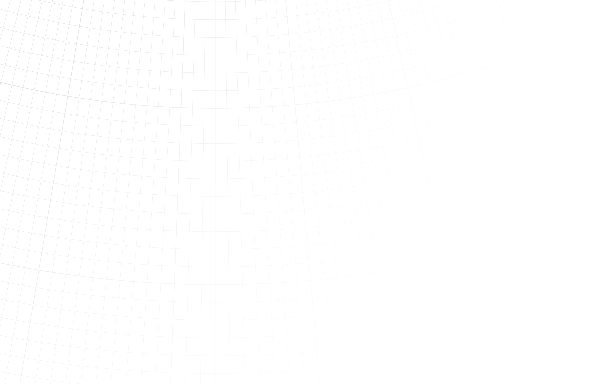
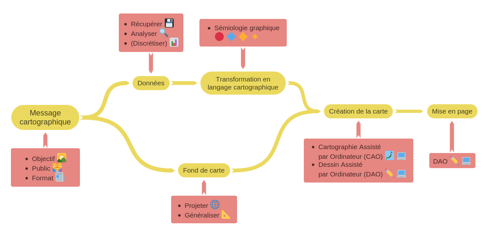
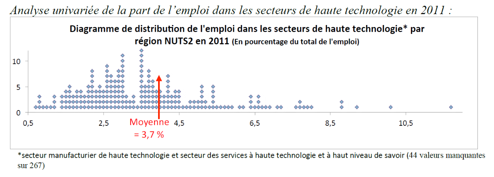
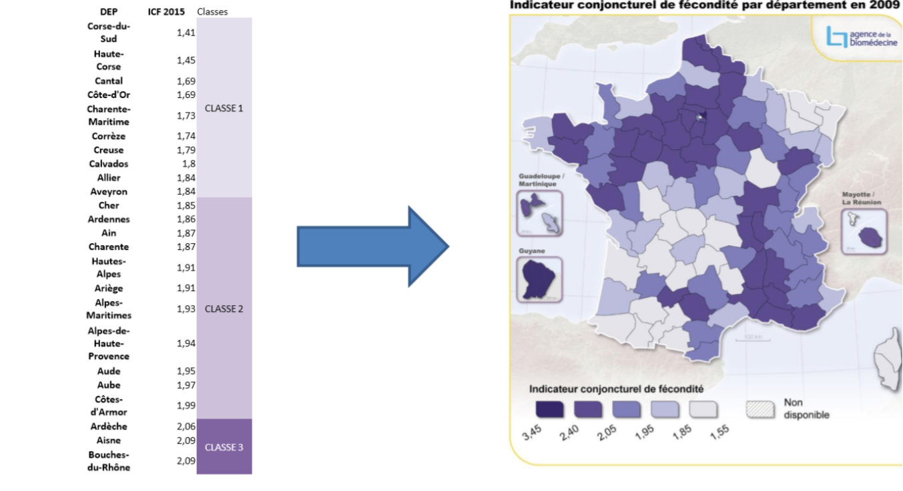

```{r setup, global_options,include=FALSE}
knitr::opts_chunk$set(
  dpi = 200,
  strip.white = T,
  message=FALSE,
  comment=NA,
  echo=FALSE,
  warning=FALSE,
  eval=TRUE
  
)
```

```{r include=FALSE}
source('./assets/functions.R')

# Les librairies
requiredPackages = c('xaringan',
                     'knitr',
                     'png',
                     'grid',
                     'gridExtra',
                     'RColorBrewer',
                     'dotenv')

PackageFacile(requiredPackages)

load_dot_env(".env")
annee = Sys.getenv("annee")

```


class: center, middle, inverse, title-slide, animated, fadeIn
# ENSG : statistiques appliquées en cartographie `r annee`
# Présentation du cours <br /> 
<br />
### florian.bayer@gmail.com


<div class="my-footer"><span>ENSG - L1 `r annee` : Statistiques appliquées en cartographie- Florian Bayer</span></div> 

---
class: animated, fadeIn
## Déroulement des séances
   
En distanciel
- Deux jours de cours
- CM et TD (non évaluée)
- PDF disponibles

<div class="my-footer"><span>ENSG - L1 `r annee` : Statistiques appliquées en cartographie- Florian Bayer</span></div> 

---
class: animated, fadeIn
## Contenu de l’enseignement
<div class="my-footer"><span>ENSG - L1 `r annee` : Statistiques appliquées en cartographie- Florian Bayer</span></div> 


Un cours sur :
- Les statistiques appliquées à la cartographie et les méthodes de discrétisation
- Mais pas un cours sur les statistiques spatiales

Axe cartographie : 
- Identifier le message à **transmettre** avec la carte
- Traiter l’information statistique de manière simple, pour **l’adapter au message cartographique**  
- Principes de la discrétisation en carto : pourquoi et quand discrétiser ?
- Discrétiser en fonction des besoins et de la forme de la série.
- Choisir le nombre de classes.
- Comment comparer des cartes avec les mêmes unités.
- Comment comparer des cartes avec des unités différentes.
- Application sur Qgis.


---
class: animated, fadeIn
## TD

Un TD en deux parties pour mettre en pratique les acquis :
- Analyse d'une série de données en géographique
- Choix de méthodes de discrétisation
- Création de cartes avec Qgis (à installer sur vos ordinateurs)

<div class="my-footer"><span>ENSG - L1 `r annee` : Statistiques appliquées en cartographie- Florian Bayer</span></div> 

---
class: inverse, center, middle, animated, fadeIn
# Contenu de l'enseignement

<div class="my-footer-title "></div> 

---
class: animated, fadeIn
## Schéma de production cartographique
<div class="my-footer"><span>Université Paris 1 Panthéon Sorbonne - M1 `r annee` : cartographie et statistique - Florian Bayer</span></div> 

.zoom[ .center-img[
```{r echo=FALSE, out.width="100%"}

```
] ]

---
class: animated, fadeIn
## Univarié

- Distinguer les types de **variables**, de **distributions**. **Décrire** une série de données, utiliser les **méthodes appropriées** à chaque type de données.
- Connaître les **principes** et **méthodes** de traitement et d’analyse de données au moyen d’outils de traitement des données.
- Maîtriser différentes méthodes de **représentation** de l’information statistique en géographie (notamment graphiques et cartographiques).

.center-img[
```{r echo=FALSE, out.width="90%"}

```
]

<div class="my-footer"><span>ENSG - L1 `r annee` : Statistiques appliquées en cartographie- Florian Bayer</span></div> 

---
class: animated, fadeIn
## Discrétisation

- Savoir **quand** il est nécessaire de discrétiser en cartographie et en statitique
- Connaître les **principes** et **méthodes** de la discrétisation
- S'appuyer sur le message cartographique et l'analyse univariée pour **choisir** et **justifier** sa méthode de discrétisation

.center-img[
```{r echo=FALSE, out.width="90%"}

```
]

<div class="my-footer"><span>ENSG - L1 `r annee` : Statistiques appliquées en cartographie- Florian Bayer</span></div> 


